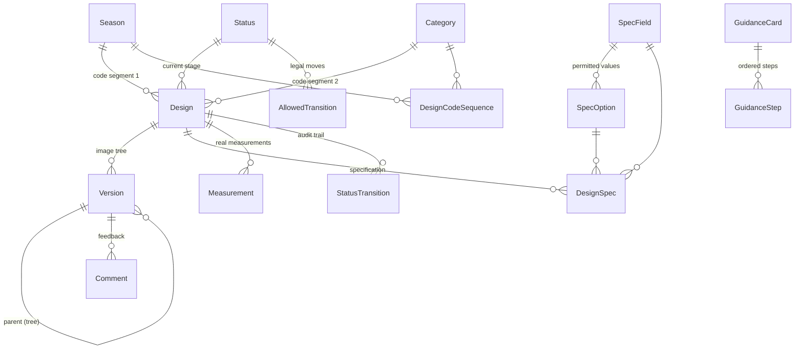

# Database

PostgreSQL 16. One Django app, `designs`, so every table below is `designs_*`
except the Django built-ins (`auth_user`, `django_session`, …).

Two rules govern the whole schema:

- **Nothing is ever deleted.** Every foreign key that points at real work is
  `ON DELETE PROTECT`. There are no delete views and admin delete is off for
  Design, Version and Comment. Retiring something is a boolean, not a `DELETE`.
- **Postgres stores keys, never image bytes.** Images live in Cloudflare R2
  (MinIO locally). See [Storage](#storage-keys) below.

---

## Map



Three groups:

| Group | Tables | Who edits them |
|---|---|---|
| **Reference data** | `season`, `category`, `status`, `allowedtransition`, `specfield`, `specoption`, `guidancecard`, `guidancestep` | The team, in django-admin. Seeded by migrations `0002` and `0004`. |
| **The work** | `design`, `version`, `comment`, `designspec`, `measurement`, `statustransition` | The application, only through `designs/services.py`. |
| **History** | `historicaldesign`, `historicalversion`, `historicalcomment`, `historicalmeasurement`, `historicaldesignspec` | `django-simple-history`, automatically. Never written by hand. |

---

## Reference data

### `designs_season`
A selling season — labelled **Drop** in the UI, via `verbose_name` on the
`Design.season` FK. Its `code` is the first segment of every design code.

| Column | Type | Notes |
|---|---|---|
| `id` | bigint PK | |
| `code` | varchar(8) **unique** | 2–8 capitals/digits, e.g. `SS26`. Validated by `CODE_SEGMENT`. |
| `label` | varchar(80) | e.g. `Spring/Summer 26` |
| `is_active` | bool | Inactive seasons stay on old designs, are not offered for new ones. |

### `designs_category`
A garment category. Its `code` is the second segment of every design code.
Same shape as Season: `code` (unique), `label`, `is_active`.

### `designs_status`
A workflow stage. **Spec §9 is still open**, so the seeded names are placeholders
and the team may rename them in admin at any time. Nothing in the application
branches on a status *name* — behaviour keys off the three booleans.

| Column | Type | Notes |
|---|---|---|
| `code` | slug **unique** | |
| `label` | varchar(60) | What the UI shows |
| `order` | smallint | Pipeline order |
| `tone` | varchar(12) | `neutral` / `progress` / `attention` / `good` / `stopped`. **Drives badge colour only** — the CSS class is `st-{tone}`, never `st-{name}`. |
| `is_initial` | bool | Where a new design starts. Constraint `only_one_initial_status` allows exactly one `true`. |
| `is_approval` | bool | Reaching it means approved, and **requires a version to be marked final**. |
| `is_terminal` | bool | No further work expected. |
| `is_active` | bool | |

Seeded in `0002_seed_reference_data.py`: Draft, In review, Revision requested,
Approved, On hold, Dropped.

### `designs_allowedtransition`
The rulebook: one row = one legal move. **Absence of a row means the move is
illegal** — `services.change_status` refuses anything not listed.

| Column | Notes |
|---|---|
| `from_status_id` → Status | CASCADE |
| `to_status_id` → Status | CASCADE |

Constraints: `unique_transition_pair`, and `transition_changes_status`
(a status cannot transition to itself). 16 pairs seeded.

### `designs_specfield`
One row of the design specification grid — the kind of attribute a garment is
described by. Works exactly like Status: **no field label appears in Python or
in a template.**

| Column | Type | Notes |
|---|---|---|
| `code` | slug **unique** | Used in URLs and form posts |
| `label` | varchar(60) | Shown above the dropdown |
| `order` | smallint | Position in the grid |
| `show_on_card` | bool | Render this value as a chip on the board card. Four or so is the useful maximum. |
| `is_active` | bool | |

15 fields with 118 options seeded in `0004_seed_spec_fields.py`. Season and Category are
deliberately **not** spec fields — they are structural, they make up the code.

### `designs_specoption`
A permitted value for one spec field.

| Column | Type | Notes |
|---|---|---|
| `field_id` → SpecField | CASCADE | |
| `label` | varchar(80) | |
| `swatch_hex` | varchar(7) | Optional `#RRGGBB` for the colour chip. **Not a Pantone match** — see `Design.colour_code` for the authoritative value. |
| `order` | smallint | |
| `is_active` | bool | **Retiring a value sets this false.** Never a `DELETE`: designs already carrying it keep it, and `PROTECT` from `designspec` would refuse the delete anyway. |

Constraint: `unique_option_label_per_field`.

### `designs_guidancecard` / `designs_guidancestep`
The external editing tools and how to use them. Presentational only — **the
application never calls a model API** (spec §1). Card: `name`, `url`, `summary`,
`order`, `is_active`. Step: `card_id` (CASCADE), `order`, `text`.

### `designs_designcodesequence`
The per-season-per-category counter behind design codes. One row per bucket,
locked with `SELECT … FOR UPDATE` during allocation so two people creating a
design at the same moment cannot receive the same code.

`season_id`, `category_id`, `next_number`. Constraint: `unique_sequence_per_bucket`.

---

## The work

### `designs_design`
A garment idea, tracked from reference photo to approval.

| Column | Type | Notes |
|---|---|---|
| `id` | **uuid** PK | Used in storage keys, so it must not be guessable from a name |
| `code` | varchar(32) **unique**, not editable | `{season}-{category}-{NNN}`, e.g. `SS26-KURTA-003`. **This is the identity.** |
| `name` | varchar(140) | A label on top of the code. Names get renamed and duplicated; codes must not. |
| `season_id` → Season | PROTECT | |
| `category_id` → Category | PROTECT | |
| `status_id` → Status | PROTECT | Current stage |
| `logo_file` | file | **Authoritative** logo artwork. Models redraw logos, so the image is not the record. |
| `colour_code` | varchar(60) | **Authoritative** Pantone or equivalent, e.g. `19-4324 TCX`. Exact shade matching in an edited image is not achievable (spec §11). |
| `colour_hex` | varchar(7) | Swatch chip only |
| `notes` | text | |
| `created_by_id` → User | PROTECT | |
| `created_at` / `updated_at` | timestamptz | |
| `approved_at` | timestamptz null | Set when the design enters an `is_approval` status, cleared when it leaves. Feeds the creation→approval metric. |

Has history. Properties (not columns): `reference_version`, `approved_version`,
`lead_time`.

### `designs_version`
One image in a design's tree. **The reference photo is version 1 with
`parent = NULL`** — there is no separate reference field on Design. One image
table, one upload path, and "branch from the original" is an ordinary parent
assignment.

| Column | Type | Notes |
|---|---|---|
| `id` | **uuid** PK | Appears in the storage key |
| `design_id` → Design | PROTECT | |
| `parent_id` → Version | PROTECT, null | **NULL = this is the reference.** Non-null = an edit branched from that version. |
| `number` | int, not editable | 1-based, allocated as `max + 1` per design |
| `requirement` | text | What this version was meant to change, in the uploader's words |
| `image_key` | varchar(255) **unique** | Object key, not a URL |
| `thumbnail_key` | varchar(255) **unique** | Lists serve this, never the full image |
| `width`, `height` | int | Computed on upload |
| `file_size` | bigint | Computed on upload |
| `content_hash` | varchar(64), indexed | SHA-256 of the uploaded bytes. A match inside the same design raises a **non-blocking** duplicate warning — a manual round-trip through external tools makes re-uploads likely. |
| `origin` | varchar(20) | `manual_upload` today; `api_generated` reserved so adding an automated source later is additive, not a rewrite (spec §10). |
| `is_approved` | bool | |
| `created_by_id` → User | PROTECT | |
| `created_at` | timestamptz | |

Constraints:
- `unique_version_number_per_design`
- `one_approved_version_per_design` — partial unique on `design_id` where `is_approved`
- `version_is_not_its_own_parent`

Has history. Properties: `is_reference`, `depth_from_reference` (how many
successive edits from the original — degradation accumulates with depth, which
is the reason to re-branch), and `display_label`.

> **Numbering vs labelling.** `number` is 1-based in the database and stays that
> way in the admin, the audit trail and every historical row. The UI calls the
> reference `REF` and later versions `v1`, `v2` … via `Version.display_label`.
> Use `display_label` in templates, `number` in URLs.

### `designs_comment`
Feedback on a **specific image**, not on the design. Which image a comment is
about is the whole point of it.

`version_id` → Version (PROTECT), `author_id` → User (PROTECT), `body` text,
`created_at`, `edited_at`. Has history — comments are never deleted and edits
keep their history.

### `designs_designspec`
One field of one design's specification. A row per value rather than columns on
Design, so adding an attribute is an admin action and not a migration.

`design_id` → Design (PROTECT), `field_id` → SpecField (PROTECT),
`option_id` → SpecOption (PROTECT). Constraint: `one_value_per_field_per_design`.
Has history, so who changed a spec value and when is on the record.

### `designs_measurement`
An authoritative real-world measurement. A child table rather than fixed
chest/length/sleeve columns, because which measurements matter differs by
category.

`design_id` → Design (PROTECT), `name` varchar(60), `value_cm` decimal(6,1)
(≥ 0), `order`. Has history.

### `designs_statustransition`
A first-class record of every status change, **including creation**. There are
no roles, so this table is the only accountability the application has.

| Column | Notes |
|---|---|
| `design_id` → Design | PROTECT |
| `from_status_id` → Status | PROTECT, **null on creation** |
| `to_status_id` → Status | PROTECT |
| `version_id` → Version | PROTECT, null. The version marked final, when this transition approved the design. |
| `actor_id` → User | PROTECT |
| `comment` | text, optional |
| `is_self_approval` | bool, not editable | Self-approval is **permitted** (spec §3) but must be plainly visible, so it is stored rather than inferred at render time. |
| `created_at` | timestamptz |

No history table — the row *is* the history.

---

## History tables

`django-simple-history` mirrors five models: `historicaldesign`,
`historicalversion`, `historicalcomment`, `historicalmeasurement`,
`historicaldesignspec`. Each carries the original columns plus:

- `history_id`, `history_date`, `history_type` (`+` create, `~` change, `-` delete)
- `history_user_id` → User, `ON DELETE SET NULL`
- `history_change_reason`

The acting user is filled in by `simple_history.middleware.HistoryRequestMiddleware`
for anything that came through a request, and set explicitly by
`services.set_spec` for anything that did not. Foreign keys in history tables are
`DO_NOTHING` by design — a historical row must survive whatever happened to the
rows it points at.

Read them in admin at `/admin/designs/design/<id>/history/`.

---

## Storage keys

Postgres holds keys, never bytes. Keys are **opaque and immutable**:

```
designs/{design_uuid}/versions/{version_uuid}.ext
designs/{design_uuid}/versions/{version_uuid}-thumb.jpg
```

Never derived from a design name or an uploaded filename — names change and
leak information. The bucket is **private**; templates link to the
`version-image` / `version-thumbnail` views, which redirect to a signed URL that
expires (600 s by default). An unsigned or expired URL returns 403.

---

## Migrations

| Migration | What it does |
|---|---|
| `0001_initial` | All tables and constraints |
| `0002_seed_reference_data` | 6 statuses, 16 legal transitions, 2 guidance cards. Reversible. |
| `0003_spec_models` | `specfield`, `specoption`, `designspec`, `historicaldesignspec` |
| `0004_seed_spec_fields` | 15 spec fields, 118 options, with colour hexes. Reversible. |

The seeds are a starting point, not a decision. Everything they insert is
editable in django-admin without a migration or a code change.

---

See also: [application.md](application.md) · [local-setup.md](local-setup.md) ·
[deploy.md](deploy.md) · [restore-test.md](restore-test.md)
